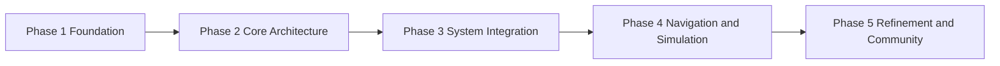

# ROS 2 Learning Path

An evidence-driven learning portfolio for becoming a ROS 2 and robotics software engineer. This repository documents the concepts, implementation exercises, and engineering decisions behind a practical path from ROS 2 fundamentals to mobile manipulation.

[Read the documentation](https://r-jeremiah.github.io/ros2-roadmap/)

[Connect on LinkedIn](https://www.linkedin.com/in/rj-mercado/)

## What This Covers

- ROS 2 architecture, communication, packages, and launch systems
- Python and C++ implementation exercises
- TF2, sensors, `ros2_control`, simulation, and navigation
- Reproducible notes, diagrams, commands, and validation results

## Roadmap

The detailed checklist is maintained in [phases.md](phases.md), and published material is available through the [documentation site](https://r-jeremiah.github.io/ros2-roadmap/).

## Current Focus

Phase 1 establishes the project structure, documentation workflow, and portfolio presentation. Later phases will add runnable ROS 2 packages and technical case studies rather than only descriptive notes.

## Documentation Stack

- Sphinx with MyST Markdown
- Furo documentation theme
- GitHub Actions and GitHub Pages

## Environment

Examples target **ROS 2 Jazzy Jalisco**. Each example will document its operating system, dependencies, build commands, run commands, expected output, and validation steps.

## Status

This is an active learning project. New topics are considered complete when they include a clear explanation and supporting evidence such as code, commands, diagrams, tests, or a documented result.